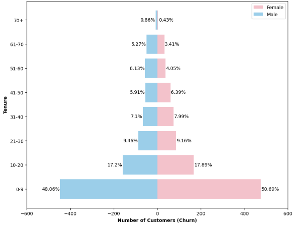
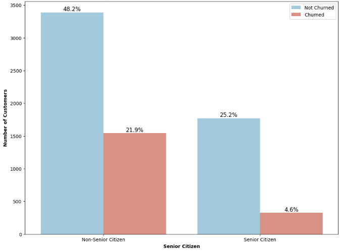
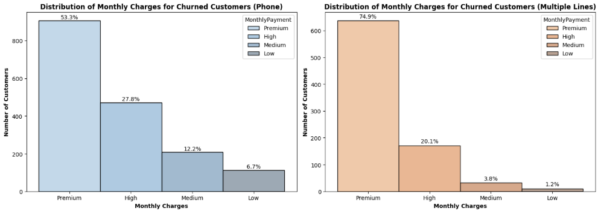
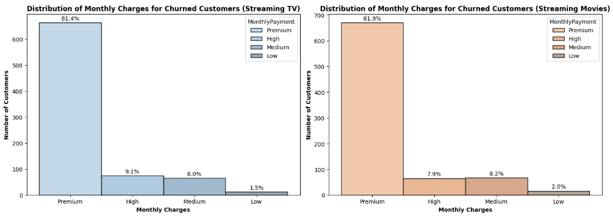
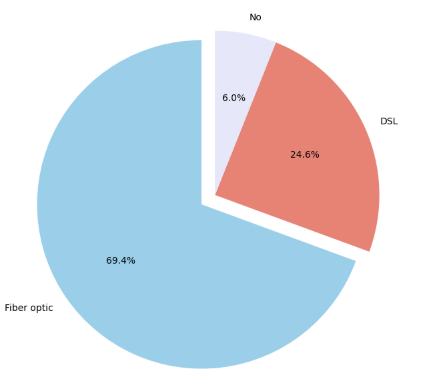
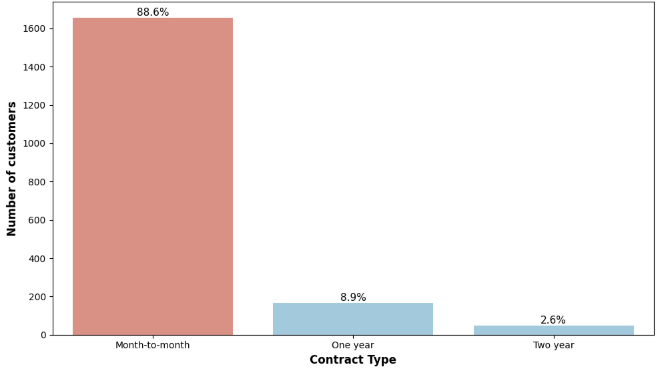
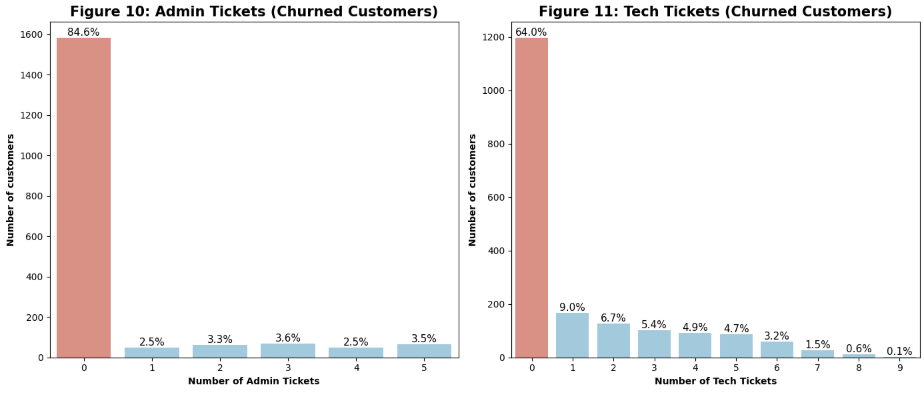
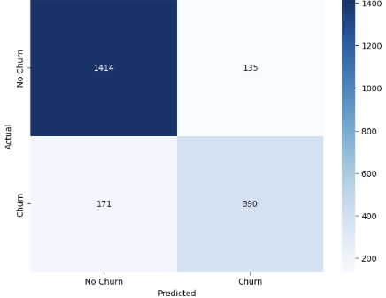
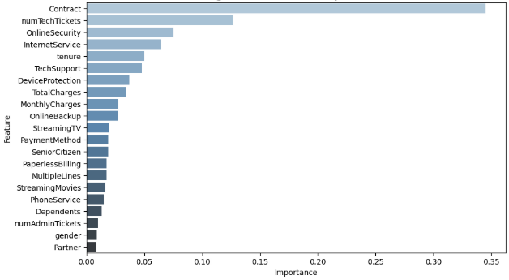

# 📊 PWC_Churn_Project

A data science project focused on predicting telecom customer churn using machine learning and exploratory data analysis (EDA).

## 🎯 Objective

Understand customer behavior and build a predictive model to identify at-risk customers, enabling proactive retention strategies.

## 🧱 Project Structure

### Phase 1: Understanding the Customer Base
- Analyze churn rate and customer segments (age, gender, tenure).
- Explore service usage, billing preferences, and contract types.

### Phase 2: Predicting Customer Churn
- Feature engineering
- Select key features (e.g. tenure, contract type, monthly charges).
- Train ML models (Logistic Regression, Decision Tree, XGBoost).
- Evaluate using accuracy, precision, recall, and F1-Score.
- Derive insights and churn reduction recommendations.

## 🛠️ Tech Stack
- Python, Jupyter Notebook
- Pandas, Scikit-learn, XGBoost, Matplotlib
- Git & GitHub

## 🖥️ Key data insights

-  Churn Distribution: 26.58% of customers have churned.

- Churn by Tenure and Gender: Nearly 50% of churned customers leave within the first 10 months. Early churn is slightly higher among females (50.69%) than males (48.06%).

-Churn by Senior Citizen Status: Non-senior citizens account for 21.9% of churn, while only 4.6% of senior citizens have churned.

- Churn by Service Usage: Premium users with multiple lines or fiber services show higher churn.

-  Churn Rate by Contract Type: Month-to-month contracts have the highest churn rate. Churn drops sharply with 1-year and 2-year contracts.

- Churn and Support Engagement: Most churned customers had little or no support interaction.

## 🤖 Models Tested
| Model                | Accuracy | Precision | Recall | F1-Score |
|---------------------|----------|-----------|--------|----------|
| Logistic Regression | 85%      | 74%       | 68%    | 0.71     |
| Decision Tree       | 83%      | 72%       | 61%    | 0.66     |
| **Tuned XGBoost**   | **85%**  | **74%**   | **70%**| **0.72** |

📌 **Tuned XGBoost** was selected for deployment due to its best recall and F1-score, making it the most effective at identifying churners.

- Top 5 Predictors of Churn (XGBoost)
1. **Contract** – Most important feature. Customers on month-to-month contracts have the highest churn risk.
2. **Technical Support Tickets (numTechTickets)** – Low interaction with support often signals silent dissatisfaction.
3. **Online Security** – Customers without security services are more likely to churn, indicating trust and safety concerns.
4. **Internet Service** – Service quality impacts churn; unreliable or poor internet increases risk.
5. **Tenure** – Shorter customer tenure strongly correlates with higher churn; new users are more likely to leave.

