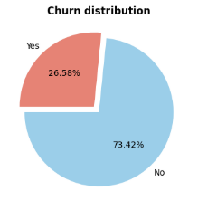

# 📊 PWC_Churn_Project

A data science project focused on predicting telecom customer churn using machine learning and exploratory data analysis (EDA).

## 🎯 Objective

Understand customer behavior and build a predictive model to identify at-risk customers, enabling proactive retention strategies.

## 🧱 Project Structure

### Phase 1: Understanding the Customer Base
- Analyze churn rate and customer segments (age, gender, tenure).
- Explore service usage, billing preferences, and contract types.

### Phase 2: Predicting Customer Churn
- Feature engineering
- Select key features (e.g. tenure, contract type, monthly charges).
- Train ML models (Logistic Regression, Decision Tree, XGBoost).
- Evaluate using accuracy, precision, recall, F1, and AUC-ROC.
- Derive insights and churn reduction recommendations.

## 🛠️ Tech Stack
- Python, Jupyter Notebook
- Pandas, Scikit-learn, XGBoost, Matplotlib
- Git & GitHub

## 🖥️ Key data insights
